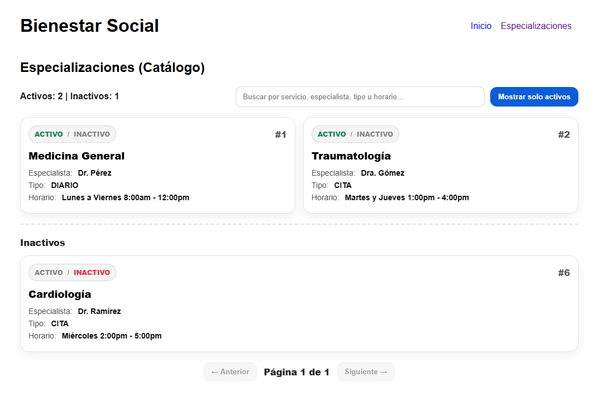

# Sistema de Especializaciones Médicas

Sistema web desarrollado como proyecto académico para la gestión de especializaciones médicas.

## Tecnologías utilizadas

- Python
- Flask
- PostgreSQL
- HTML
- CSS

## Funcionalidades

- Visualización dinámica de especializaciones médicas
- Activación y desactivación de especialidades
- Búsqueda de especializaciones
- Sistema conectado a base de datos PostgreSQL
- Estructura modular usando Flask Blueprints

## Estructura del proyecto

app/
- especializaciones/
- templates/
- static/
- models.py

migraciones/
- control de versiones de la base de datos

## Instalación

1. Clonar el repositorio
2. Instalar dependencias
3. Ejecutar el proyecto

## Autor

Gabriel Díaz  
Estudiante de Ingeniería Informática

## Capturas del sistema

### Catálogo de especialidades

### Especialidades activas e inactivas

